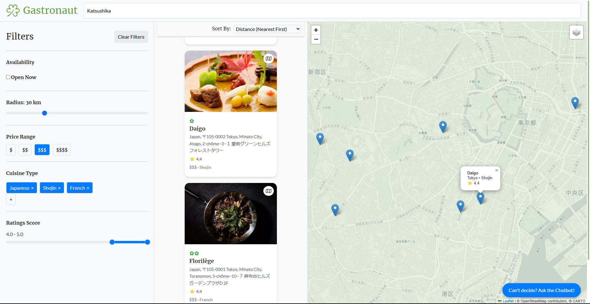

# Gastronaut – Michelin Green Star Recommender


\


---


This project is a **web-based recommendation system** designed to help users discover **MICHELIN Green Star restaurants**, an annual award which highlights restaurants at the forefront of the industry when it comes to their **sustainable practices**.\
It combines data from **Michelin Guide**, **Google Places API**, and **Reddit reviews** to provide personalized restaurant recommendations. The application also features an **interactive chatbot** powered by natural language processing for conversational restaurant suggestions.

## Features



-   🌍 **Interactive Map Display**: Visualize restaurant locations and explore nearby options.
-   🔍 **Advanced Search & Filters**: Search restaurants by location and refine results with criteria such as:
    -   Radius
    -   Price Range
    -   Cuisine Type
    -   Ratings Score
-   🎯 **Dynamic Sorting**: Sort results by distance, rating, price, or relevance to your preferences.
-   🤖 **Chatbot Integration**: Interact with the AI-powered chatbot, to receive personalized recommendations.
-   📊 **AI-Powered Recommendations**: Recommendations driven by state-of-the-art embedding models (HuggingFace, SentenceTransformers).
-   🧾 **Review Summarization**: Extract insights from Google Reviews and Reddit discussions to understand restaurant popularity and sentiments.
-   💬 **Conversational UI**: A chatbot integrated seamlessly into the web interface for quick and user-friendly interaction.

## Installation

### Prerequisites

-   Python 3.12 or later

### Steps

1. **Clone the repository**:

    ```sh
    git clone https://github.com/atinyshrimp/webscraping-ml-project.git
    cd webscraping-ml-project
    ```

2. **Set up a virtual environment**:

    ```sh
     python -m venv venv
     source venv/bin/activate  # On Windows: `venv\Scripts\activate`
    ```

3. **Install the required packages**:

    ```sh
    pip install -r requirements.txt
    ```

## Usage

1. **Run the Flask application**:

    ```sh
    flask run
    ```

2. **Open the application in your browser**:
    ```
    http://127.0.0.1:5000/
    ```

## Project Structure

```bash
webscraping-ml-project
+---data
|   +---processed
|   |       expanded_restaurants_google_places.csv
|   |       restaurants_with_reddit_reviews.csv
|   |       reviews.csv
|   |
|   \---raw
|           green_star_michelin_restaurants.csv
|           restaurants_google_places_api_raw.csv
|
+---deliverables
|       gastronaut_demo.mkv
|       Webscraping_ML_Project_LAPILUS_DIA2.pdf
|
+---models
|   |   chatbot.py
|   |
|   \---__pycache__
|           chatbot.cpython-312.pyc
|           data_collection.cpython-312.pyc
|
+---notebooks
|       data_collection.ipynb
|       nlp_pipeline.ipynb
|
+---static
|   +---css
|   |       styles.css
|   |
|   +---img
|   |
|   \---js
|           chatbot.js
|           map.js
|
\---templates
|       base.html
|   .env
|   .gitignore
|   app.py
|   README.md
|   requirements.txt
```

## Data Sources

-   [**Michelin Guide**](https://guide.michelin.com/en/us/restaurants): Information about Michelin-starred restaurants with the Green Star distinction.
-   [**Photon API**](https://photon.komoot.io/): Implementation of a search-as-you-type search bar for dynamic user experience.
-   [**Google Places API**](https://developers.google.com/maps/documentation/places/web-service/text-search?apix_params=%7B%22fields%22%3A%22places.id%2Cplaces.formattedAddress%2Cplaces.websiteUri%2Cplaces.rating%2Cplaces.reviews%2Cplaces.regularOpeningHours.periods%2Cplaces.googleMapsLinks.directionsUri%22%2C%22resource%22%3A%7B%22textQuery%22%3A%22The%20Inn%20At%20Little%20Washington%2C%20Washington%2C%20USA%22%2C%22includedType%22%3A%22restaurant%22%7D%7D): Details about restaurant locations, ratings, and reviews.
-   [**Reddit API – PRAW**](https://praw.readthedocs.io/en/stable/code_overview/models/subreddit.html#praw.models.Subreddit.search): Authentic user discussions on restaurant quality and experience.

## Notebooks

-   **data_collection.ipynb**: Data extraction and cleaning pipeline.
-   **nlp_pipeline.ipynb**: Embedding similarity, and model development.

## Deliverables

The `deliverables` folder contains materials that showcase the project's output and functionality:

-   `Webscraping_ML_Project_LAPILUS_DIA2.pdf`: A support for a 5-minute presentation summarizing the project, its goals, methodology, results, and insights.
-   `gastronaut_demo.mkv`: A recorded demonstration of the project's features, including web scraping, recommendation system, and chatbot functionality.

Feel free to review these materials for a concise overview of the project.

## Contact

For any inquiries, please [contact me](mailto:joyce.lapilus@gmail.com).

## Acknowledgements

-   Data sourced from Google Places API, Michelin Guide, and Reddit.
-   Developed as part of the Michelin Green Star Recommender Project.
